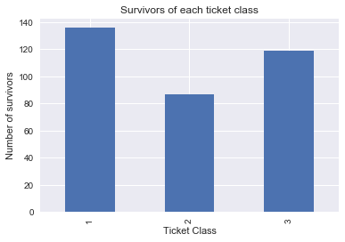
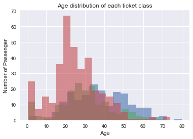
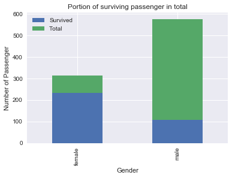

# Titanic survival analysis

## Introduction

In this project, I will analysis dataset of Titanic using Python libraries Numpy, Panda and Matplotlib. According to the Titanic dataset, there are five questions I want to answer from it. The five questions are:
    1. Which ticket class has the most survivors and which has the least surviors?
    2. What are the age patterns of each ticket class.
    3. Average number of relative of all passengers.
    4. Which sex has the most surviors?
    5. The correlation between fare and ticket class.
I will answer all of this questions in following content.

## Data Wrangling


```python
import pandas as pd
import numpy as np
import seaborn as sns
import matplotlib.pyplot as plt
from IPython.display import display
%matplotlib inline
```


```python
# Test data and show each field, so that I can check them easily in the future.
titanic_df = pd.read_csv('titanic-data.csv')
display(titanic_df.head())
```


<div>
<style>
    .dataframe thead tr:only-child th {
        text-align: right;
    }

    .dataframe thead th {
        text-align: left;
    }

    .dataframe tbody tr th {
        vertical-align: top;
    }
</style>
<table border="1" class="dataframe">
  <thead>
    <tr style="text-align: right;">
      <th></th>
      <th>PassengerId</th>
      <th>Survived</th>
      <th>Pclass</th>
      <th>Name</th>
      <th>Sex</th>
      <th>Age</th>
      <th>SibSp</th>
      <th>Parch</th>
      <th>Ticket</th>
      <th>Fare</th>
      <th>Cabin</th>
      <th>Embarked</th>
    </tr>
  </thead>
  <tbody>
    <tr>
      <th>0</th>
      <td>1</td>
      <td>0</td>
      <td>3</td>
      <td>Braund, Mr. Owen Harris</td>
      <td>male</td>
      <td>22.0</td>
      <td>1</td>
      <td>0</td>
      <td>A/5 21171</td>
      <td>7.2500</td>
      <td>NaN</td>
      <td>S</td>
    </tr>
    <tr>
      <th>1</th>
      <td>2</td>
      <td>1</td>
      <td>1</td>
      <td>Cumings, Mrs. John Bradley (Florence Briggs Th...</td>
      <td>female</td>
      <td>38.0</td>
      <td>1</td>
      <td>0</td>
      <td>PC 17599</td>
      <td>71.2833</td>
      <td>C85</td>
      <td>C</td>
    </tr>
    <tr>
      <th>2</th>
      <td>3</td>
      <td>1</td>
      <td>3</td>
      <td>Heikkinen, Miss. Laina</td>
      <td>female</td>
      <td>26.0</td>
      <td>0</td>
      <td>0</td>
      <td>STON/O2. 3101282</td>
      <td>7.9250</td>
      <td>NaN</td>
      <td>S</td>
    </tr>
    <tr>
      <th>3</th>
      <td>4</td>
      <td>1</td>
      <td>1</td>
      <td>Futrelle, Mrs. Jacques Heath (Lily May Peel)</td>
      <td>female</td>
      <td>35.0</td>
      <td>1</td>
      <td>0</td>
      <td>113803</td>
      <td>53.1000</td>
      <td>C123</td>
      <td>S</td>
    </tr>
    <tr>
      <th>4</th>
      <td>5</td>
      <td>0</td>
      <td>3</td>
      <td>Allen, Mr. William Henry</td>
      <td>male</td>
      <td>35.0</td>
      <td>0</td>
      <td>0</td>
      <td>373450</td>
      <td>8.0500</td>
      <td>NaN</td>
      <td>S</td>
    </tr>
  </tbody>
</table>
</div>


```python
# Show statistic of Titanic dataset
titanic_df.describe()
```


<div>
<style>
    .dataframe thead tr:only-child th {
        text-align: right;
    }

    .dataframe thead th {
        text-align: left;
    }

    .dataframe tbody tr th {
        vertical-align: top;
    }
</style>
<table border="1" class="dataframe">
  <thead>
    <tr style="text-align: right;">
      <th></th>
      <th>PassengerId</th>
      <th>Survived</th>
      <th>Pclass</th>
      <th>Age</th>
      <th>SibSp</th>
      <th>Parch</th>
      <th>Fare</th>
    </tr>
  </thead>
  <tbody>
    <tr>
      <th>count</th>
      <td>891.000000</td>
      <td>891.000000</td>
      <td>891.000000</td>
      <td>714.000000</td>
      <td>891.000000</td>
      <td>891.000000</td>
      <td>891.000000</td>
    </tr>
    <tr>
      <th>mean</th>
      <td>446.000000</td>
      <td>0.383838</td>
      <td>2.308642</td>
      <td>29.699118</td>
      <td>0.523008</td>
      <td>0.381594</td>
      <td>32.204208</td>
    </tr>
    <tr>
      <th>std</th>
      <td>257.353842</td>
      <td>0.486592</td>
      <td>0.836071</td>
      <td>14.526497</td>
      <td>1.102743</td>
      <td>0.806057</td>
      <td>49.693429</td>
    </tr>
    <tr>
      <th>min</th>
      <td>1.000000</td>
      <td>0.000000</td>
      <td>1.000000</td>
      <td>0.420000</td>
      <td>0.000000</td>
      <td>0.000000</td>
      <td>0.000000</td>
    </tr>
    <tr>
      <th>25%</th>
      <td>223.500000</td>
      <td>0.000000</td>
      <td>2.000000</td>
      <td>20.125000</td>
      <td>0.000000</td>
      <td>0.000000</td>
      <td>7.910400</td>
    </tr>
    <tr>
      <th>50%</th>
      <td>446.000000</td>
      <td>0.000000</td>
      <td>3.000000</td>
      <td>28.000000</td>
      <td>0.000000</td>
      <td>0.000000</td>
      <td>14.454200</td>
    </tr>
    <tr>
      <th>75%</th>
      <td>668.500000</td>
      <td>1.000000</td>
      <td>3.000000</td>
      <td>38.000000</td>
      <td>1.000000</td>
      <td>0.000000</td>
      <td>31.000000</td>
    </tr>
    <tr>
      <th>max</th>
      <td>891.000000</td>
      <td>1.000000</td>
      <td>3.000000</td>
      <td>80.000000</td>
      <td>8.000000</td>
      <td>6.000000</td>
      <td>512.329200</td>
    </tr>
  </tbody>
</table>
</div>


```python
titanic_df.isnull().sum()
```


    PassengerId      0
    Survived         0
    Pclass           0
    Name             0
    Sex              0
    Age            177
    SibSp            0
    Parch            0
    Ticket           0
    Fare             0
    Cabin          687
    Embarked         2
    dtype: int64


**Note**: In the statistic above, I found there are some missing value in Age, Cabin and Embark. Next, when I need to analyze data of age, cabin and Embark, I will remove those missing value, then do the analysis. However, if I analyze other fields not contain missing value, I will just use them.

## Exploration

### 1.Which ticket class has the most survivors and which has the least survivors?


```python
# total number of passenger of each ticket class
pclass_total = titanic_df.groupby(['Pclass']).count()
print pclass_total['PassengerId']

# total number of survivors of each ticket class
survivors = titanic_df.groupby(['Survived', 'Pclass']).count()
survivors_on_class = survivors.loc[1]['PassengerId']
print survivors_on_class

# plot result
survivors_on_class.plot(kind = 'bar')
plt.title('Survivors of each ticket class')
plt.xlabel('Ticket Class')
plt.ylabel('Number of survivors')
```

    Pclass
    1    216
    2    184
    3    491
    Name: PassengerId, dtype: int64
    Pclass
    1    136
    2     87
    3    119
    Name: PassengerId, dtype: int64


    <matplotlib.text.Text at 0x11230f190>





From above result, we knew that **first class** has the **most** surviors and **second class** has the **least** surviors. But the interseting thing was that more than half of the first class passenger were saved.

### 2. What are the age patterns of each ticket class


```python
# clean data by dropping nan age row
titanic_no_nan_age = titanic_df[['Age','Pclass']].dropna(axis = 0, how='any')

# group data without nan age by Pclass and Age
pclass_total2 = titanic_no_nan_age.groupby('Pclass')['Age']
print pclass_total2.describe()
pclass_total2.plot.hist(alpha=0.6,stacked=True, bins=20)
plt.title('Age distribution of each ticket class')
plt.xlabel('Age')
plt.ylabel('Number of Passenger')
```

            count       mean        std   min   25%   50%   75%   max
    Pclass                                                           
    1       186.0  38.233441  14.802856  0.92  27.0  37.0  49.0  80.0
    2       173.0  29.877630  14.001077  0.67  23.0  29.0  36.0  70.0
    3       355.0  25.140620  12.495398  0.42  18.0  24.0  32.0  74.0


    <matplotlib.text.Text at 0x1155f4f90>





From the statistic data, first class passengers have the highest values of mean, standard deviation, minimal and maximal age. Then third class passengers have the lowest statistic values. That result can be also approved by that half of third class passenger were 18 to 32 years old, half of second class passenger were 23 to 36 years old and half of first class passenger were 27 to 49 years old. What's more, I also found that age of third class spread less because of lower standard deviation.

### 3. Average number of relative of all passengers.


```python
average_relative = titanic_df['SibSp'].mean()+titanic_df['Parch'].mean()
print average_relative
```

    0.904601571268


This is a easy question, so the average number of relative is 0.9 person.

### 4. Which sex has the most survivors


```python
# create the crosstab
ct = pd.crosstab(index=titanic_df['Sex'], columns=titanic_df['Survived'])
# add a 'Total' column, but total is perished passengers, which can make stacked graph correct
ct['Total'] = ct[0]
# remove the column with perished passengers
ct.drop(0, axis=1, inplace=True)
# rename the columns and plot the crosstab
ct.columns=['Survived', 'Total']
ax = ct.plot(kind='bar',stacked='True')
plt.title('Portion of surviving passenger in total')
plt.xlabel('Gender')
plt.ylabel('Number of Passenger')
```


    <matplotlib.text.Text at 0x1170e2bd0>





From the result above, we saw most of survivors were female and more than 75% of females were rescued. So we may imply that men tried their best to save women when the Titanic sinked. And we can also find another result that the amount of male passengers are more than double of female's.

### 5. The correlation between fare and ticket class.


```python
corr_age_pclass = titanic_df['Pclass'].corr(titanic_df['Fare'])
print 'Correlation coefficient is '+ str(corr_age_pclass)+'.'
```

    Correlation coefficient is -0.549499619944.


This is a commen sence that higher class ticket is expensive and lower class ticket is cheap. I want to check if the data can approve my expection. The result is that the correlation between ticket class and fare is close to -1, so there is a relationship between them. And since the correlation coefficient belows 0,we can get that first class ticket has higher fare as I expect.

## Conclusion

In the conclusion, we saw a lot interesting reuslts which answer my questions very well. For the first question, I plot the number of surviors of each class, and it is easy to find out that first class has the most surviors and second class has the fewest survivors. For the second question, the statistic data and histogram shows the pattern of each class, for example first class passengers' mean age was older and the age of third class spread less. For the third question, the mean value is clearly answered average number of relative for each passenger. As for the fourth questions, the histogram tells us that there are more female surviors than man. What's more, the correlation coefficient value can approve my commen sense. And because of the efficient panda and numpy library, my implementation is not time-consuming and can get results in several seconds. Finally, the way I deal with missing value is dropping the whole row which will produce more correct result.

However, there are plenty of limitations in my implementation and analysis. For example, there are many fields of data are not involved, and they may draw other intresting conclusions. Furthermore, there are a lot of amazing plot functions provided by panda and they can make conclusions more obvious. Finally, I think my questions are simple and want to come up with complicated questions involving serveral parameters and draw interesting conclusion.


## Refernces

[1]<https://github.com/adam-p/markdown-here/wiki/Markdown-Cheatsheet><br />
[2]<https://github.com/pandas-dev/pandas/blob/master/doc/cheatsheet/Pandas_Cheat_Sheet.pdf><br />
[3]<https://pandas.pydata.org/pandas-docs/stable/visualization.html><br />
[4]<https://stackoverflow.com/questions/21487329/add-x-and-y-labels-to-a-pandas-plot><br />
[5]<https://pandas.pydata.org/pandas-docs/stable/generated/pandas.DataFrame.html><br />
[6]<https://matplotlib.org/users/pyplot_tutorial.html><br />
[7]<https://stackoverflow.com/questions/42579908/use-corr-to-get-the-the-correlation-between-two-columns><br />
[8]<http://www.pythonforbeginners.com/concatenation/string-concatenation-and-formatting-in-python>
